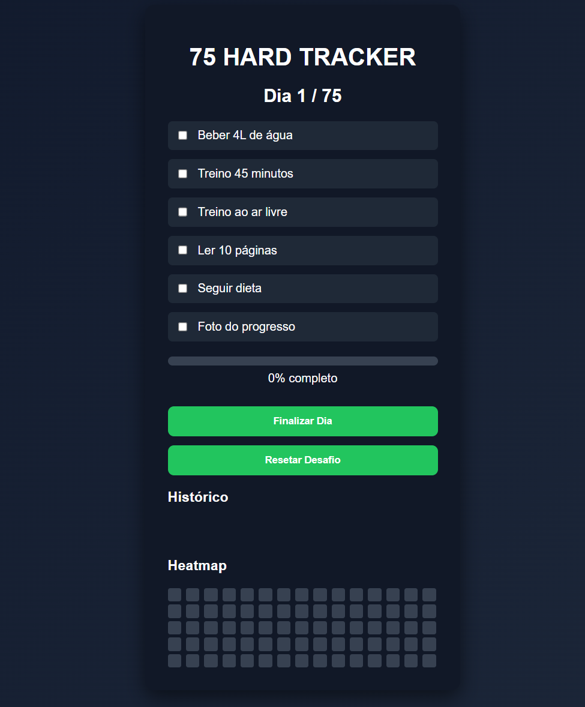

# 75 Hard Tracker

A simple web application to track your progress during the **75 Hard Challenge**.

This project allows users to mark daily tasks, track progress, visualize completed days, and view a progress heatmap.
---

---
##  Overview

This was built to help users stay consistent with the 75 Hard challenge by providing:

- Daily task checklist
- Progress bar
- Completed days history
- Automatic saving using **LocalStorage**

---

##  Features

- ✔ Daily task checklist
- ✔ Automatic progress calculation
- ✔ Advance to the next day when tasks are completed
- ✔ History organized in columns (5 days per column)
- ✔ GitHub-style progress heatmap
- ✔ Data persistence with **LocalStorage**
- ✔ Reset challenge button

---

##  Technologies Used

- **HTML**
- **CSS**
- **JavaScript**
- **LocalStorage**

---

## Project Goal

This project was built to practice:

- **DOM manipulation**
- **Frontend interface development**
- **Browser data persistence**
- Building a small **JavaScript web application**

---

## 🌐 Live Demo

[Here](https://vini-9.github.io/75-hard-tracker/)

---

##  Author

Developed by **Vinicius Hajime**.
